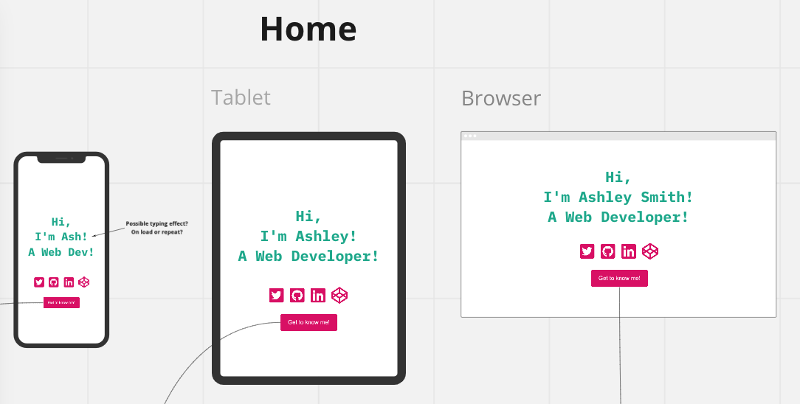
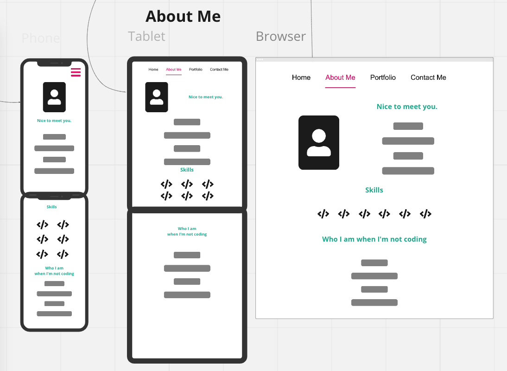
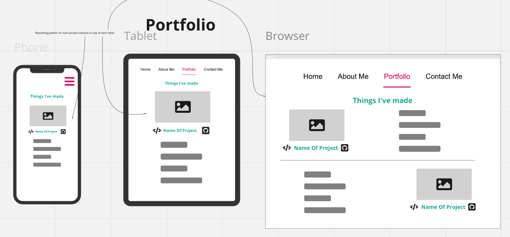
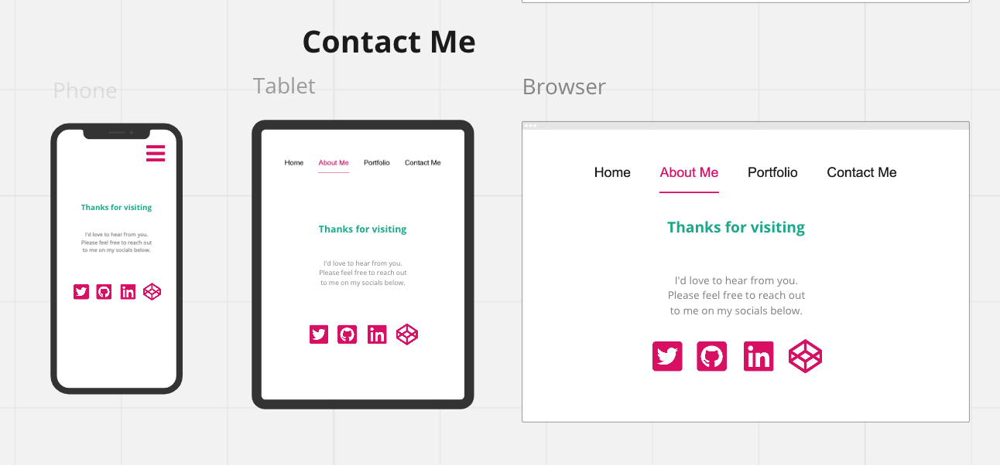

# Portfolio Website V2

## Author

Ashley Smith - [GitHub](https://github.com/Ash-Eileen) | [Portfolio](https://ashleysmith.netlify.app/) | [Twitter](https://twitter.com/Ash413_) | [LinkedIn](https://ashleysmith.netlify.app/contact.html)

## Purpose

This is new, polished version of my porfolio website to replace my original portfolio which was made using only HTML and CSS. I've decided to make a new portfolio as I've developed new skills and it gives me an excellent chance to further my skills in React and to learn more about Typescript.

## Features

For this version of my portfolio I've chosen to use a single page style layout with fixed menu that can be used to traverse the sections of the page. I'm keen to make the site as accessible as possible and to use a mobile first approach to make sure it is user-friendly.

### Navigation

To navigate the site I've chosen a hamburger menu icon for mobile and tablet and a sticky top menu for desktop. On mobile I've chosen a single column style for information and for tablet and desktop elected to display further expand the content on the page.

### Homepage/Index

This is a single line very brief introduction to say who I am and what my role is.

### About Page

To try and showcase a little about myself to try and let potential employers know a little about who I am. This should demonstrate a bit about why I'm becoming a developer and my past experience. I also want to include some information about my hobbies and interests.

### Portfolio Page

Since this is a portfolio site this where I'll be showcasing some of my previous projects. I'll be highlighting some projects that were large or that I'm proud of with a quick description of what they are, the tech stack used and a link to the GitHub repository.

### Contact

This section will focus on linking through to my social media profiles so people know how to get in touch with me.

## Wireframes

I chose to use Miro to make some basic wireframes so that coding can be a much easier process. For the wireframes they show each specific section of the portfolio site with a mobile, tablet and desktop.

The Miro workspace is available [here](https://miro.com/app/board/o9J_ld3pzAU=/).

### Homepage

### About Me

### Portfolio

### Contact Me

## Tech Stack

- HTML
- CSS
- JavaScript
- React
- Typescript

## Design

Colour Scheme:

- #0CA789 for headings
- #DA0063 for buttons and icons
- #404040 for text

Font options:

- Inconsolata & Montserrat (heading & body)
- Droid Sans (body)
- Lato (body)
- Pontano Sans (body)
- Flamenco & Asap (headings & body)
- Proza Libre & Open Sans (headings & body)
- Rubik & Karla (headings & body)
- Quattrocento & Quattrocento Sans (headings & body)
- Inconsolata & Karla (headings & body)
